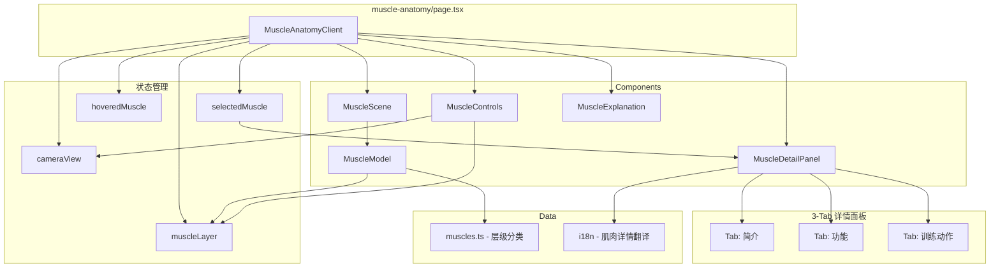

# Design Document

## Overview

为3D人体肌肉解剖展示工具新增两个核心功能：
1. **肌肉层级系统** - 支持表层/深层肌肉切换显示
2. **3-Tab 肌肉详情面板** - 点击肌肉后显示简介、功能、训练动作三个标签页

## Architecture

### 技术栈（现有）

- **React Three Fiber** (`@react-three/fiber`) - React 的 Three.js 渲染器
- **Drei** (`@react-three/drei`) - R3F 常用工具集
- **Three.js** - 3D 渲染引擎
- **Next.js 15** - 现有项目框架
- **TypeScript** - 类型安全
- **Shadcn/UI** - UI 组件库（用于 Tabs 组件）

### 组件架构更新

```
src/components/muscle-anatomy/
├── muscle-anatomy-client.tsx    # 主客户端组件（更新）
├── muscle-scene.tsx             # 3D 场景组件（更新）
├── muscle-model.tsx             # 肌肉模型加载组件（更新）
├── muscle-controls.tsx          # 控制面板（更新：添加层级切换）
├── muscle-tooltip.tsx           # 肌肉名称提示组件（移除，功能合并到详情面板）
├── muscle-detail-panel.tsx      # 新增：3-Tab 肌肉详情面板
└── muscle-explanation.tsx       # SEO 说明内容（保持不变）
```

## Components and Interfaces

### MuscleAnatomyClient（更新）

主客户端组件，新增层级状态管理。

```tsx
interface MuscleAnatomyClientProps {
  locale: Locale;
  dict: Dictionary;
}

// 新增状态
const [muscleLayer, setMuscleLayer] = useState<'superficial' | 'deep'>('superficial');
```

### MuscleScene（更新）

3D 场景容器，传递层级信息。

```tsx
interface MuscleSceneProps {
  selectedMuscle: string | null;
  onMuscleSelect: (muscleId: string | null) => void;
  onMuscleHover: (muscleId: string | null) => void;
  hoveredMuscle: string | null;
  cameraView: 'front' | 'back' | 'default';
  muscleLayer: 'superficial' | 'deep';  // 新增
}
```

### MuscleModel（更新）

根据层级显示/隐藏肌肉。

```tsx
interface MuscleModelProps {
  onMuscleClick: (muscleId: string) => void;
  onMuscleHover: (muscleId: string | null) => void;
  hoveredMuscle: string | null;
  selectedMuscle: string | null;
  muscleLayer: 'superficial' | 'deep';  // 新增
}
```

### MuscleControls（更新）

控制面板，新增层级切换按钮。

```tsx
interface MuscleControlsProps {
  onViewChange: (view: 'front' | 'back' | 'default') => void;
  onReset: () => void;
  currentView: 'front' | 'back' | 'default';
  muscleLayer: 'superficial' | 'deep';  // 新增
  onLayerChange: (layer: 'superficial' | 'deep') => void;  // 新增
  dict: Dictionary;
}
```

### MuscleDetailPanel（新增）

3-Tab 肌肉详情面板组件。

```tsx
interface MuscleDetailPanelProps {
  muscleId: string | null;
  locale: Locale;
  dict: Dictionary;
  onClose: () => void;
}

// 内部状态
const [activeTab, setActiveTab] = useState<'overview' | 'functions' | 'exercises'>('overview');
```

## Data Models

### 肌肉数据结构更新

```typescript
// src/lib/data/muscles.ts

export interface MuscleInfo {
  id: string;                                    // 肌肉 ID
  group: 'upper' | 'torso' | 'lower';           // 身体部位分组
  layer: 'superficial' | 'deep';                // 新增：肌肉层级
}

// 肌肉层级分类
export const SUPERFICIAL_MUSCLES = [
  // 表层肌肉列表
  'pectoralis_major',
  'deltoid_anterior',
  'deltoid_lateral', 
  'deltoid_posterior',
  'biceps_brachii',
  'triceps_brachii',
  'latissimus_dorsi',
  'trapezius',
  'rectus_abdominis',
  'external_oblique',
  'gluteus_maximus',
  'quadriceps',
  'rectus_femoris',
  'vastus_lateralis',
  'vastus_medialis',
  'hamstrings',
  'biceps_femoris',
  'gastrocnemius',
  'tibialis_anterior',
  // ... 更多表层肌肉
];

export const DEEP_MUSCLES = [
  // 深层肌肉列表
  'pectoralis_minor',
  'serratus_anterior',
  'subscapularis',
  'supraspinatus',
  'infraspinatus',
  'teres_minor',
  'rhomboid_major',
  'rhomboid_minor',
  'erector_spinae',
  'multifidus',
  'transverse_abdominis',
  'internal_oblique',
  'iliopsoas',
  'gluteus_medius',
  'gluteus_minimus',
  'vastus_intermedius',
  'soleus',
  'tibialis_posterior',
  // ... 更多深层肌肉
];

// 根据层级获取肌肉
export function getMusclesByLayer(layer: 'superficial' | 'deep'): string[] {
  return layer === 'superficial' ? SUPERFICIAL_MUSCLES : DEEP_MUSCLES;
}

// 判断肌肉属于哪个层级
export function getMuscleLayer(muscleId: string): 'superficial' | 'deep' {
  if (SUPERFICIAL_MUSCLES.includes(muscleId)) return 'superficial';
  if (DEEP_MUSCLES.includes(muscleId)) return 'deep';
  return 'superficial'; // 默认表层
}
```

### i18n 类型扩展

```typescript
// 添加到 src/lib/i18n/types.ts

export interface MuscleDetailDict {
  overview: string;        // 简介
  functions: string;       // 功能
  exercises: string;       // 训练动作
  description: string;     // 肌肉描述
  functionsList: string[]; // 功能列表（1. 2. 3.）
  exercisesList: string[]; // 训练动作列表
  placeholder: string;     // "内容待补充"
}

export interface MuscleAnatomyDict {
  title: string;
  description: string;
  metaDescription: string;
  controls: {
    frontView: string;
    backView: string;
    reset: string;
    superficialLayer: string;  // 新增：表层
    deepLayer: string;         // 新增：深层
  };
  loading: string;
  webglError: string;
  clickToView: string;
  selectedMuscle: string;
  muscleGroups: {
    upper: string;
    torso: string;
    lower: string;
  };
  // 新增：详情面板
  detailPanel: {
    tabs: {
      overview: string;    // 简介
      functions: string;   // 功能
      exercises: string;   // 训练动作
    };
    placeholder: string;   // 内容待补充
    close: string;         // 关闭
  };
  explanation: {
    title: string;
    whatIs: string;
    whatIsContent: string;
    benefits: string;
    benefitsList: string[];
    howToUse: string;
    howToUseList: string[];
  };
  // 肌肉名称翻译
  muscles: Record<string, string>;
  // 新增：肌肉详情（简介、功能、训练动作）
  muscleDetails: Record<string, {
    description: string;     // 简介描述
    functions: string[];     // 功能列表
    exercises: string[];     // 训练动作列表
  }>;
}
```

### 肌肉详情数据结构

```typescript
// 在 i18n 翻译文件中的结构示例

muscleDetails: {
  pectoralis_major: {
    description: '胸大肌是胸部最大的肌肉，呈扇形覆盖在胸廓前面...',
    functions: [
      '使上臂在肩关节处内收',
      '使上臂在肩关节处屈曲',
      '使上臂在肩关节处内旋',
    ],
    exercises: [
      '卧推（杠铃/哑铃）',
      '上斜卧推',
      '飞鸟',
      '俯卧撑',
    ],
  },
  biceps_brachii: {
    description: '肱二头肌位于上臂前侧，由长头和短头组成...',
    functions: [
      '屈曲肘关节',
      '前臂旋后',
      '协助肩关节屈曲',
    ],
    exercises: [
      '杠铃弯举',
      '哑铃弯举',
      '锤式弯举',
      '牧师凳弯举',
    ],
  },
  // ... 其他肌肉（暂时使用占位符）
}
```

## Error Handling

### 肌肉详情数据缺失

```tsx
// 在 MuscleDetailPanel 中处理数据缺失
function getMuscleDetail(muscleId: string, dict: Dictionary) {
  const detail = dict.muscleAnatomy.muscleDetails[muscleId];
  
  if (!detail) {
    return {
      description: dict.muscleAnatomy.detailPanel.placeholder,
      functions: [],
      exercises: [],
    };
  }
  
  return {
    description: detail.description || dict.muscleAnatomy.detailPanel.placeholder,
    functions: detail.functions?.length > 0 ? detail.functions : [],
    exercises: detail.exercises?.length > 0 ? detail.exercises : [],
  };
}
```

### 层级切换动画

```tsx
// 使用 CSS transition 实现平滑过渡
useEffect(() => {
  scene.traverse((child) => {
    if (child instanceof THREE.Mesh) {
      const muscleId = getMuscleIdFromModelName(child.name);
      const layer = getMuscleLayer(muscleId);
      
      // 根据当前层级设置可见性
      const shouldShow = layer === muscleLayer;
      
      // 使用 opacity 过渡
      if (child.material instanceof THREE.MeshStandardMaterial) {
        child.material.transparent = true;
        child.material.opacity = shouldShow ? 1 : 0;
        child.visible = shouldShow;
      }
    }
  });
}, [muscleLayer, scene]);
```

## Testing Strategy

### 手动测试清单

1. **层级切换** - 验证表层/深层切换正确显示对应肌肉
2. **层级切换动画** - 验证切换时有平滑过渡效果
3. **深层肌肉交互** - 验证深层肌肉可以被点击和悬停
4. **详情面板显示** - 验证点击肌肉后显示3-Tab面板
5. **Tab切换** - 验证三个标签页切换正常
6. **占位符显示** - 验证未填充数据时显示"内容待补充"
7. **多语言** - 验证中英文切换后详情内容同步更新
8. **移动端** - 验证移动端详情面板以底部抽屉形式显示

## UI Design

### 层级切换按钮

```tsx
// 使用 Toggle Group 样式
<div className="flex gap-2">
  <Button
    variant={muscleLayer === 'superficial' ? 'default' : 'outline'}
    size="sm"
    onClick={() => onLayerChange('superficial')}
    className="rounded-full"
  >
    <Layers className="h-4 w-4 mr-1" />
    {dict.muscleAnatomy.controls.superficialLayer}
  </Button>
  <Button
    variant={muscleLayer === 'deep' ? 'default' : 'outline'}
    size="sm"
    onClick={() => onLayerChange('deep')}
    className="rounded-full"
  >
    <Layers className="h-4 w-4 mr-1" />
    {dict.muscleAnatomy.controls.deepLayer}
  </Button>
</div>
```

### 3-Tab 详情面板

```tsx
// 使用 Shadcn Tabs 组件
<Tabs defaultValue="overview" className="w-full">
  <TabsList className="grid w-full grid-cols-3">
    <TabsTrigger value="overview">
      {dict.muscleAnatomy.detailPanel.tabs.overview}
    </TabsTrigger>
    <TabsTrigger value="functions">
      {dict.muscleAnatomy.detailPanel.tabs.functions}
    </TabsTrigger>
    <TabsTrigger value="exercises">
      {dict.muscleAnatomy.detailPanel.tabs.exercises}
    </TabsTrigger>
  </TabsList>
  
  <TabsContent value="overview">
    <div className="space-y-4">
      <h3 className="font-semibold text-lg">
        {dict.muscleAnatomy.muscles[muscleId]}
      </h3>
      <p className="text-muted-foreground">
        {muscleDetail.description}
      </p>
    </div>
  </TabsContent>
  
  <TabsContent value="functions">
    <ol className="list-decimal list-inside space-y-2">
      {muscleDetail.functions.length > 0 ? (
        muscleDetail.functions.map((func, index) => (
          <li key={index}>{func}</li>
        ))
      ) : (
        <p className="text-muted-foreground italic">
          {dict.muscleAnatomy.detailPanel.placeholder}
        </p>
      )}
    </ol>
  </TabsContent>
  
  <TabsContent value="exercises">
    <ul className="space-y-2">
      {muscleDetail.exercises.length > 0 ? (
        muscleDetail.exercises.map((exercise, index) => (
          <li key={index} className="flex items-center gap-2">
            <Dumbbell className="h-4 w-4 text-primary" />
            {exercise}
          </li>
        ))
      ) : (
        <p className="text-muted-foreground italic">
          {dict.muscleAnatomy.detailPanel.placeholder}
        </p>
      )}
    </ul>
  </TabsContent>
</Tabs>
```

## File Structure Updates

```
nextjs-app/
├── src/
│   ├── components/
│   │   └── muscle-anatomy/
│   │       ├── muscle-anatomy-client.tsx  # 更新：添加层级状态
│   │       ├── muscle-scene.tsx           # 更新：传递层级
│   │       ├── muscle-model.tsx           # 更新：根据层级显示/隐藏
│   │       ├── muscle-controls.tsx        # 更新：添加层级切换按钮
│   │       ├── muscle-detail-panel.tsx    # 新增：3-Tab 详情面板
│   │       ├── muscle-tooltip.tsx         # 保留：简化为仅显示名称
│   │       └── muscle-explanation.tsx     # 保持不变
│   └── lib/
│       ├── data/
│       │   └── muscles.ts                 # 更新：添加层级分类
│       └── i18n/
│           └── locales/
│               ├── zh/
│               │   └── muscle-anatomy.ts  # 更新：添加详情翻译
│               └── en/
│                   └── muscle-anatomy.ts  # 更新：添加详情翻译
```

## Mermaid Diagram



## Implementation Priority

1. **Phase 1: 数据层更新**
   - 更新 muscles.ts 添加层级分类
   - 更新 i18n 翻译文件添加新的翻译键和肌肉详情结构

2. **Phase 2: 层级切换功能**
   - 更新 MuscleControls 添加层级切换按钮
   - 更新 MuscleModel 根据层级显示/隐藏肌肉
   - 更新 MuscleAnatomyClient 管理层级状态

3. **Phase 3: 详情面板**
   - 创建 MuscleDetailPanel 组件
   - 实现 3-Tab 布局
   - 集成到主组件

4. **Phase 4: 填充示例数据**
   - 为主要肌肉填充简介、功能、训练动作数据
   - 其他肌肉使用占位符

---

## 新增功能设计：骨骼显示与腹部肌肉修复

### 骨骼显示设计

#### 骨骼识别逻辑

```typescript
// 骨骼关键词列表
const BONE_KEYWORDS = [
  'bone',
  'skeleton',
  'skull',
  'vertebra',
  'vertebrae',
  'spine',
  'rib',
  'sternum',
  'clavicle',
  'scapula',
  'humerus',
  'radius',
  'ulna',
  'carpal',
  'metacarpal',
  'phalanx',
  'pelvis',
  'ilium',
  'ischium',
  'pubis',
  'sacrum',
  'coccyx',
  'femur',
  'patella',
  'tibia',
  'fibula',
  'tarsal',
  'metatarsal',
  'calcaneus',
  'talus',
  'mandible',
  'maxilla',
];

// 检查是否是骨骼
function isBone(name: string): boolean {
  const lowerName = name.toLowerCase();
  return BONE_KEYWORDS.some(keyword => lowerName.includes(keyword));
}
```

#### 骨骼材质设置

```typescript
// 骨骼使用半透明浅色材质
if (isBone(child.name)) {
  if (child.material instanceof THREE.MeshStandardMaterial) {
    child.material.color = new THREE.Color(0xf5f5dc); // 米白色
    child.material.transparent = true;
    child.material.opacity = 0.6;
    child.material.roughness = 0.8;
    child.material.metalness = 0.0;
  }
  // 禁用骨骼的射线检测，使其不可点击
  child.layers.disable(0);
}
```

### 腹部肌肉点击修复

#### 问题分析

当前腹部肌肉（腹直肌、前锯肌等）无法点击的可能原因：
1. 模型中这些肌肉的 mesh 名称未被正确识别
2. 这些肌肉被其他 mesh 遮挡
3. 射线检测配置问题

#### 解决方案

1. **扩展肌肉关键词列表**

```typescript
const muscleKeywords = [
  // ... 现有关键词
  'rectus abdominis',  // 腹直肌
  'serratus',          // 前锯肌
  'oblique',           // 斜肌
  'transversus',       // 腹横肌
  'abdominal',         // 腹部相关
];
```

2. **添加腹部肌肉别名映射**

```typescript
const muscleAliases: Record<string, string[]> = {
  // ... 现有映射
  'rectus_abdominis': ['rectus abdominis', 'rectus abdominus'],
  'serratus_anterior': ['serratus anterior', 'serratus'],
  'external_oblique': ['external abdominal oblique', 'external oblique'],
  'internal_oblique': ['internal abdominal oblique', 'internal oblique'],
  'transverse_abdominis': ['transversus abdominis', 'transverse abdominis'],
};
```

3. **调试日志**

```typescript
// 在模型加载时输出腹部相关 mesh 名称
clone.traverse((child) => {
  if (child instanceof THREE.Mesh) {
    const lowerName = child.name.toLowerCase();
    if (lowerName.includes('abdom') || 
        lowerName.includes('rectus') || 
        lowerName.includes('serratus') ||
        lowerName.includes('oblique')) {
      console.log('Abdominal mesh found:', child.name);
    }
  }
});
```

### 主要肌群3-Tab内容完善

#### 需要完善的肌肉列表

| 肌群 | 肌肉ID | 优先级 |
|------|--------|--------|
| 上肢 | deltoid_anterior, deltoid_lateral, deltoid_posterior | 高 |
| 上肢 | biceps_brachii, triceps_brachii | 高 |
| 上肢 | forearm_flexors, forearm_extensors, brachioradialis | 中 |
| 躯干 | pectoralis_major, pectoralis_minor | 高 |
| 躯干 | latissimus_dorsi, trapezius | 高 |
| 躯干 | rectus_abdominis, external_oblique, serratus_anterior | 高 |
| 躯干 | erector_spinae, rhomboids | 中 |
| 下肢 | gluteus_maximus, gluteus_medius | 高 |
| 下肢 | quadriceps_femoris, rectus_femoris, vastus_lateralis, vastus_medialis | 高 |
| 下肢 | hamstrings, biceps_femoris, semitendinosus | 高 |
| 下肢 | adductors, adductor_magnus, adductor_longus | 中 |
| 下肢 | gastrocnemius, soleus | 高 |
| 下肢 | tibialis_anterior | 中 |

#### 内容模板

每块肌肉的详情应包含：

```typescript
{
  description: string;  // 100-200字的解剖描述
  functions: string[];  // 3-5个主要功能
  exercises: string[];  // 4-6个训练动作
}
```

### 测试清单更新

1. **骨骼显示测试**
   - 验证骨骼以半透明浅色显示
   - 验证骨骼不响应悬停高亮
   - 验证骨骼不响应点击
   - 验证骨骼不遮挡肌肉点击

2. **腹部肌肉测试**
   - 验证腹直肌可点击
   - 验证前锯肌可点击
   - 验证腹外斜肌可点击
   - 验证点击后显示正确的详情面板

3. **3-Tab内容测试**
   - 验证所有主要肌群有完整的3-Tab内容
   - 验证中英文内容同步
   - 验证内容格式正确（编号列表、图标列表）

