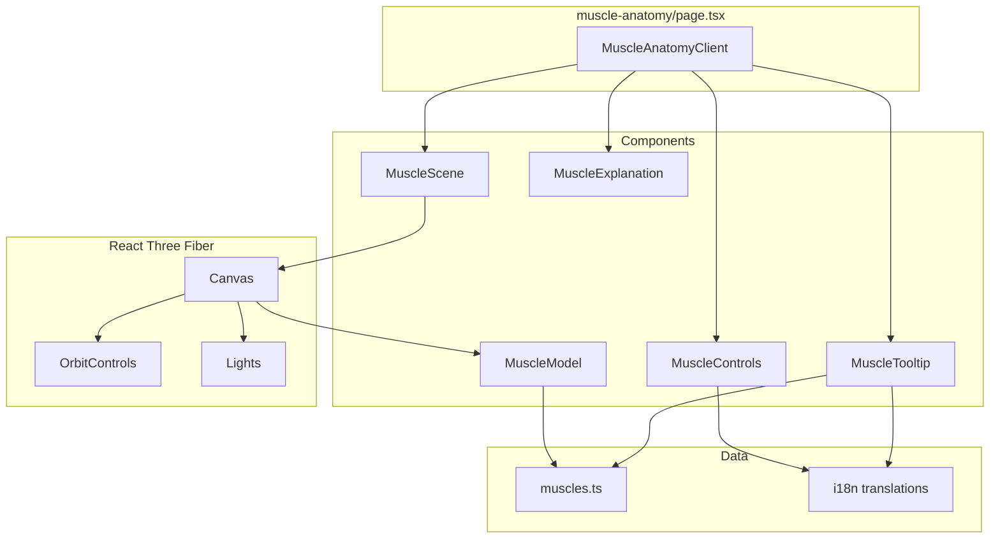

# Design Document

## Overview

3D人体肌肉解剖展示工具（MVP版本），使用 React Three Fiber 实现交互式3D肌肉模型展示。用户可以旋转、缩放模型，点击肌肉查看名称。

## Architecture

### 技术栈

- **React Three Fiber** (`@react-three/fiber`) - React 的 Three.js 渲染器
- **Drei** (`@react-three/drei`) - R3F 常用工具集（OrbitControls、useGLTF、Html 等）
- **Three.js** - 3D 渲染引擎（作为 peer dependency）
- **Next.js 15** - 现有项目框架
- **TypeScript** - 类型安全

### 3D模型方案

使用开源的人体肌肉 GLTF 模型，模型需满足：
- 每块肌肉为独立的 mesh，便于点击交互
- 模型大小控制在 3MB 以内（压缩后）
- 使用 Draco 压缩减小体积

推荐模型来源：
1. **Sketchfab** - 搜索 "human muscle anatomy" 筛选 CC 许可
2. **CGTrader** - 免费的 Three.js 兼容解剖模型
3. **AnatomyTOOL Open 3D Model** - 开源解剖模型项目

### 组件架构

```
src/components/muscle-anatomy/
├── muscle-anatomy-client.tsx    # 主客户端组件
├── muscle-scene.tsx             # 3D 场景组件
├── muscle-model.tsx             # 肌肉模型加载组件
├── muscle-controls.tsx          # 控制面板（视图切换、重置）
├── muscle-tooltip.tsx           # 肌肉名称提示组件
└── muscle-explanation.tsx       # SEO 说明内容
```

## Components and Interfaces

### MuscleAnatomyClient

主客户端组件，整合3D场景和控制面板。

```tsx
interface MuscleAnatomyClientProps {
  locale: Locale;
  dict: Dictionary;
}
```

### MuscleScene

3D 场景容器，包含 Canvas、灯光、相机控制。

```tsx
interface MuscleSceneProps {
  selectedMuscle: string | null;
  onMuscleSelect: (muscleId: string | null) => void;
  onMuscleHover: (muscleId: string | null) => void;
  hoveredMuscle: string | null;
  cameraView: 'front' | 'back' | 'default';
  dict: Dictionary;
}
```

### MuscleModel

加载和渲染 GLTF 肌肉模型，处理点击和悬停事件。

```tsx
interface MuscleModelProps {
  onMuscleClick: (muscleId: string) => void;
  onMuscleHover: (muscleId: string | null) => void;
  hoveredMuscle: string | null;
  selectedMuscle: string | null;
}
```

### MuscleControls

控制面板，包含视图切换按钮和重置按钮。

```tsx
interface MuscleControlsProps {
  onViewChange: (view: 'front' | 'back' | 'default') => void;
  onReset: () => void;
  currentView: 'front' | 'back' | 'default';
  dict: Dictionary;
}
```

### MuscleTooltip

显示肌肉名称的浮动提示。

```tsx
interface MuscleTooltipProps {
  muscleId: string | null;
  position: { x: number; y: number } | null;
  dict: Dictionary;
}
```

## Data Models

### 肌肉数据结构

```typescript
// src/lib/data/muscles.ts

export interface MuscleInfo {
  id: string;           // 模型中的 mesh 名称
  nameZh: string;       // 中文名称
  nameEn: string;       // 英文名称
  group: 'upper' | 'torso' | 'lower';  // 身体部位分组
}

export const muscleData: MuscleInfo[] = [
  // 上肢
  { id: 'deltoid', nameZh: '三角肌', nameEn: 'Deltoid', group: 'upper' },
  { id: 'biceps', nameZh: '肱二头肌', nameEn: 'Biceps', group: 'upper' },
  { id: 'triceps', nameZh: '肱三头肌', nameEn: 'Triceps', group: 'upper' },
  { id: 'forearm', nameZh: '前臂肌群', nameEn: 'Forearm', group: 'upper' },
  
  // 躯干
  { id: 'pectoralis', nameZh: '胸大肌', nameEn: 'Pectoralis Major', group: 'torso' },
  { id: 'latissimus', nameZh: '背阔肌', nameEn: 'Latissimus Dorsi', group: 'torso' },
  { id: 'trapezius', nameZh: '斜方肌', nameEn: 'Trapezius', group: 'torso' },
  { id: 'rectus_abdominis', nameZh: '腹直肌', nameEn: 'Rectus Abdominis', group: 'torso' },
  { id: 'obliques', nameZh: '腹斜肌', nameEn: 'Obliques', group: 'torso' },
  { id: 'erector_spinae', nameZh: '竖脊肌', nameEn: 'Erector Spinae', group: 'torso' },
  
  // 下肢
  { id: 'gluteus', nameZh: '臀大肌', nameEn: 'Gluteus Maximus', group: 'lower' },
  { id: 'quadriceps', nameZh: '股四头肌', nameEn: 'Quadriceps', group: 'lower' },
  { id: 'hamstrings', nameZh: '腘绳肌', nameEn: 'Hamstrings', group: 'lower' },
  { id: 'gastrocnemius', nameZh: '腓肠肌', nameEn: 'Gastrocnemius', group: 'lower' },
  { id: 'soleus', nameZh: '比目鱼肌', nameEn: 'Soleus', group: 'lower' },
];

// 根据 ID 获取肌肉信息
export function getMuscleById(id: string): MuscleInfo | undefined {
  return muscleData.find(m => m.id === id);
}

// 获取肌肉显示名称
export function getMuscleName(id: string, locale: 'zh' | 'en'): string {
  const muscle = getMuscleById(id);
  if (!muscle) return id;
  return locale === 'zh' ? muscle.nameZh : muscle.nameEn;
}
```

### i18n 类型扩展

```typescript
// 添加到 src/lib/i18n/types.ts

export interface MuscleAnatomyDict {
  title: string;
  description: string;
  metaDescription: string;
  controls: {
    frontView: string;
    backView: string;
    reset: string;
  };
  loading: string;
  webglError: string;
  clickToView: string;
  explanation: {
    title: string;
    whatIs: string;
    whatIsContent: string;
    benefits: string;
    benefitsList: string[];
  };
}
```

## Error Handling

### WebGL 不支持

```tsx
function WebGLCheck({ children, fallback }: { children: React.ReactNode; fallback: React.ReactNode }) {
  const [supported, setSupported] = useState<boolean | null>(null);
  
  useEffect(() => {
    const canvas = document.createElement('canvas');
    const gl = canvas.getContext('webgl') || canvas.getContext('experimental-webgl');
    setSupported(!!gl);
  }, []);
  
  if (supported === null) return null;
  if (!supported) return <>{fallback}</>;
  return <>{children}</>;
}
```

### 模型加载失败

使用 React Suspense 和 ErrorBoundary 处理加载状态和错误。

```tsx
<ErrorBoundary fallback={<ModelLoadError />}>
  <Suspense fallback={<LoadingSpinner />}>
    <MuscleModel />
  </Suspense>
</ErrorBoundary>
```

## Testing Strategy

### 手动测试清单

1. **模型加载** - 验证模型正确加载和显示
2. **相机控制** - 测试旋转、缩放功能
3. **肌肉交互** - 测试悬停高亮和点击显示名称
4. **视图切换** - 测试正面/背面视图切换
5. **响应式** - 测试移动端触摸操作
6. **多语言** - 测试中英文切换

## Implementation Notes

### React Three Fiber 基本用法

```tsx
import { Canvas } from '@react-three/fiber';
import { OrbitControls, useGLTF } from '@react-three/drei';

function Scene() {
  return (
    <Canvas camera={{ position: [0, 0, 5], fov: 50 }}>
      <ambientLight intensity={0.5} />
      <directionalLight position={[10, 10, 5]} intensity={1} />
      <Suspense fallback={null}>
        <Model />
      </Suspense>
      <OrbitControls enablePan={false} />
    </Canvas>
  );
}

function Model() {
  const { scene } = useGLTF('/models/muscle-anatomy.glb');
  return <primitive object={scene} />;
}
```

### 肌肉点击交互

```tsx
function MuscleModel({ onMuscleClick, onMuscleHover, hoveredMuscle }) {
  const { scene } = useGLTF('/models/muscle-anatomy.glb');
  
  // 遍历模型中的所有 mesh，添加交互事件
  useEffect(() => {
    scene.traverse((child) => {
      if (child instanceof THREE.Mesh) {
        child.userData.originalColor = child.material.color.clone();
      }
    });
  }, [scene]);
  
  return (
    <primitive 
      object={scene}
      onPointerOver={(e) => {
        e.stopPropagation();
        onMuscleHover(e.object.name);
      }}
      onPointerOut={() => onMuscleHover(null)}
      onClick={(e) => {
        e.stopPropagation();
        onMuscleClick(e.object.name);
      }}
    />
  );
}
```

### 高亮效果

```tsx
// 悬停时改变材质颜色
useEffect(() => {
  scene.traverse((child) => {
    if (child instanceof THREE.Mesh) {
      if (child.name === hoveredMuscle) {
        child.material.emissive.setHex(0x444444);
      } else {
        child.material.emissive.setHex(0x000000);
      }
    }
  });
}, [hoveredMuscle, scene]);
```

### 相机视图切换

```tsx
import { useThree } from '@react-three/fiber';
import { gsap } from 'gsap'; // 或使用 @react-spring/three

function useCameraAnimation() {
  const { camera } = useThree();
  
  const animateToView = (view: 'front' | 'back' | 'default') => {
    const positions = {
      front: [0, 0, 5],
      back: [0, 0, -5],
      default: [2, 1, 5],
    };
    
    gsap.to(camera.position, {
      x: positions[view][0],
      y: positions[view][1],
      z: positions[view][2],
      duration: 0.5,
    });
  };
  
  return { animateToView };
}
```

## File Structure

```
nextjs-app/
├── public/
│   └── models/
│       └── muscle-anatomy.glb      # 3D 肌肉模型
├── src/
│   ├── app/
│   │   └── [locale]/
│   │       └── tools/
│   │           └── muscle-anatomy/
│   │               ├── page.tsx    # 页面入口
│   │               └── layout.tsx  # SEO metadata
│   ├── components/
│   │   └── muscle-anatomy/
│   │       ├── muscle-anatomy-client.tsx
│   │       ├── muscle-scene.tsx
│   │       ├── muscle-model.tsx
│   │       ├── muscle-controls.tsx
│   │       ├── muscle-tooltip.tsx
│   │       └── muscle-explanation.tsx
│   └── lib/
│       ├── data/
│       │   └── muscles.ts          # 肌肉数据
│       └── i18n/
│           └── locales/
│               ├── zh/
│               │   └── muscle-anatomy.ts
│               └── en/
│                   └── muscle-anatomy.ts
```

## Dependencies to Install

```bash
npm install three @react-three/fiber @react-three/drei
npm install -D @types/three
```

## Mermaid Diagram


