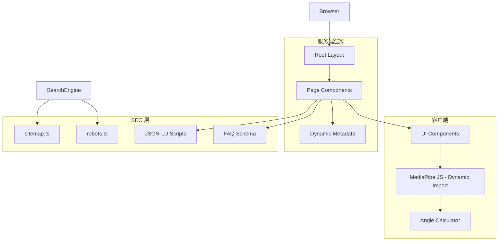

# Design Document

## Overview

本设计文档描述健身 AI 工具站的技术架构，基于 Next.js 15 App Router 构建。系统采用移动端优先的响应式设计，包含全局布局、SEO 基础设施、共享导航组件，以及两个核心工具页面（健美造型评分器和 FFMI 计算器）。架构设计为未来多语言扩展预留空间。

## Architecture

### 技术栈

- **框架**: Next.js 15 (App Router)
- **语言**: TypeScript 5.x
- **样式**: Tailwind CSS 4.x
- **UI 组件**: Shadcn UI
- **姿态检测**: MediaPipe Tasks Vision 0.10.8 (via dynamic import)

### 项目结构

```
nextjs-app/
├── src/
│   ├── app/
│   │   ├── layout.tsx              # 根布局，包含 SiteHeader + Footer
│   │   ├── page.tsx                # 首页 (Landing Page)
│   │   ├── sitemap.ts              # 动态站点地图
│   │   ├── robots.ts               # 爬虫规则
│   │   ├── error.tsx               # 全局错误边界
│   │   └── tools/
│   │       ├── pose-comparator/
│   │       │   ├── layout.tsx      # 页面 metadata
│   │       │   └── page.tsx        # 健美造型评分器 (Client Component)
│   │       └── ffmi-calculator/
│   │           ├── layout.tsx      # 页面 metadata
│   │           └── page.tsx        # FFMI 计算器
│   ├── components/
│   │   ├── layout/
│   │   │   ├── site-header.tsx     # 响应式导航头部
│   │   │   ├── mobile-nav.tsx      # 移动端 Sheet 导航
│   │   │   └── footer.tsx          # 页脚（联系方式、快速链接）
│   │   ├── home/
│   │   │   ├── hero-section.tsx    # Hero 区域（渐变背景、双按钮）
│   │   │   ├── feature-grid.tsx    # 功能网格
│   │   │   ├── why-choose-us.tsx   # 为什么选择我们
│   │   │   └── use-cases.tsx       # 适用场景与关键词
│   │   ├── pose-comparator/
│   │   │   ├── image-upload.tsx    # 图片上传组件
│   │   │   ├── pose-canvas.tsx     # 姿态绘制画布
│   │   │   ├── score-display.tsx   # 评分展示
│   │   │   ├── angle-analysis.tsx  # 角度分析
│   │   │   ├── pose-categories.tsx # 健美造型分类介绍
│   │   │   ├── scoring-explanation.tsx # 评分原理说明
│   │   │   └── limitations.tsx     # 局限性警告
│   │   ├── ffmi-calculator/
│   │   │   ├── ffmi-form.tsx       # 输入表单（含性别选择）
│   │   │   ├── ffmi-result.tsx     # 结果展示（可视化）
│   │   │   ├── ffmi-reference.tsx  # 参考标准表
│   │   │   ├── ffmi-chart.tsx      # 年龄关系图表
│   │   │   └── ffmi-explanation.tsx # 原理说明
│   │   └── ui/                     # Shadcn UI 组件
│   ├── lib/
│   │   ├── i18n/
│   │   │   └── zh.ts               # 中文文本字符串
│   │   ├── mediapipe/
│   │   │   └── pose-detector.ts    # MediaPipe 动态导入封装
│   │   ├── utils/
│   │   │   ├── ffmi.ts             # FFMI 计算逻辑
│   │   │   ├── angle-calculator.ts # 角度计算与评分
│   │   │   └── cn.ts               # className 合并工具
│   │   └── config/
│   │       ├── site.ts             # 站点配置
│   │       └── navigation.ts       # 导航配置
│   └── types/
│       └── pose.ts                 # 姿态相关类型定义
├── public/
│   └── images/                     # 静态图片资源
└── package.json
```

### 数据流架构



## Components and Interfaces

### SiteHeader 组件

```typescript
// components/layout/site-header.tsx
interface SiteHeaderProps {
  className?: string;
}

// 响应式行为:
// - md+ (>=768px): 水平导航链接
// - <md: 汉堡菜单图标 + Sheet 抽屉
// - 当前路由高亮使用 usePathname()
```

### Footer 组件

```typescript
// components/layout/footer.tsx
// 三栏布局:
// - 品牌名称 + 简介
// - 快速链接（导航菜单）
// - 联系方式（合作/广告邮箱）
// 底部: 版权信息 + 预留链接位置
```

### Hero Section 组件

```typescript
// components/home/hero-section.tsx
interface HeroSectionProps {
  title: string;
  description: string;
  subtitle?: string;  // 工具列表
  ctaText: string;
  ctaHref: string;
}
// 特性: 渐变背景、标签徽章、双按钮、用户数统计
```

### Pose Scorer 组件群

```typescript
// 图片上传
interface ImageUploadProps {
  label: string;
  onImageSelect: (file: File, dataUrl: string) => void;
}

// 姿态画布
interface PoseCanvasProps {
  imageUrl: string;
  userPose?: PoseResult | null;
  skeletonColor?: string;
  angleResults?: AngleResult[];
  showAngleDiff?: boolean;
}

// 评分展示
interface ScoreDisplayProps {
  score: number;
}

// 角度分析
interface AngleAnalysisProps {
  angles: AngleResult[];
}
```

### FFMI Calculator 组件群

```typescript
// 表单
interface FFMIFormProps {
  onCalculate: (data: FFMIInput) => void;
}

// 结果展示
interface FFMIResultProps {
  result: FFMIOutput;
  weight: number;
}

// 图表
interface FFMIChartProps {
  currentFFMI?: number;
}
```

## Data Models

### 姿态数据模型

```typescript
interface PoseLandmark {
  x: number;          // 0-1 normalized
  y: number;          // 0-1 normalized
  z: number;          // depth
  visibility: number; // 0-1 confidence
}

interface PoseResult {
  landmarks: PoseLandmark[];
  worldLandmarks: PoseLandmark[];
  timestamp: number;
}

interface AngleResult {
  name: string;
  referenceAngle: number;
  userAngle: number;
  difference: number;
  score: number;
}
```

### FFMI 计算模型

```typescript
interface FFMIInput {
  heightCm: number;
  weightKg: number;
  bodyFatPercent: number;
}

interface FFMIOutput {
  ffm: number;           // Fat-Free Mass (kg)
  ffmi: number;          // Raw FFMI
  adjustedFfmi: number;  // Height-adjusted FFMI
  category: FFMICategory;
  interpretation: string;
}

type FFMICategory = 
  | 'below_average'  // < 18
  | 'average'        // 18-20
  | 'above_average'  // 20-22
  | 'excellent'      // 22-25
  | 'elite';         // > 25
```

### 站点配置模型

```typescript
// lib/config/site.ts
interface SiteConfig {
  name: string;           // "健身AI工具站"
  description: string;
  url: string;
  ogImage: string;
  keywords: string[];
  links: {
    github?: string;
  };
}

// lib/config/navigation.ts
interface NavItem {
  title: string;
  href: string;
  description?: string;
}
```

## SEO Implementation

### Metadata 配置

```typescript
// 根布局 metadata
export const metadata: Metadata = {
  metadataBase: new URL(siteConfig.url),
  title: {
    default: '健身AI工具站',
    template: '%s | 健身AI工具站',
  },
  description: siteConfig.description,
  keywords: siteConfig.keywords,
  openGraph: { ... },
  twitter: { ... },
  robots: { index: true, follow: true },
};
```

### JSON-LD 结构化数据

- **首页**: WebSite + Organization schemas
- **FFMI 计算器**: SoftwareApplication + FAQPage schemas
- **健美造型评分器**: SoftwareApplication + FAQPage schemas

### 隐藏 SEO 关键词

使用 `sr-only` class 添加对用户不可见但对搜索引擎可见的关键词列表。

## Error Handling

| 场景 | 处理方式 |
|-----|---------|
| MediaPipe 加载失败 | 显示错误提示，建议刷新页面 |
| 未检测到人体 | 显示友好提示，建议上传完整人体图片 |
| FFMI 输入无效 | 显示字段级验证错误 |
| 图片文件过大 | 显示 10MB 限制提示 |

## Contact Information

- **合作/广告**: quanquanyiyi520@gmail.com
