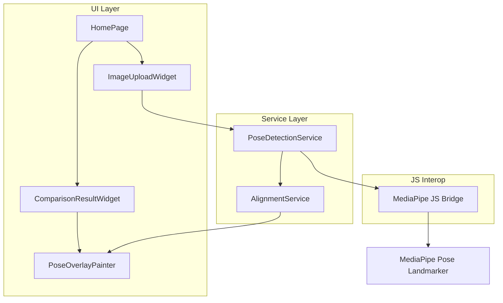

# 设计文档

## 概述

本文档描述了 Flutter Web 姿态对比应用的技术设计。该应用使用 MediaPipe Pose Landmarker (通过 JavaScript interop) 进行姿态检测，并通过自定义对齐算法将参考骨架映射到用户图片上进行可视化对比。

### 技术栈

- **Framework**: Flutter Web (Dart)
- **AI Vision**: MediaPipe Pose Landmarker (@mediapipe/tasks-vision)
- **Image Handling**: file_picker, image
- **Math**: dart:math, 自定义向量计算

## 架构



### 目录结构

```
lib/
├── main.dart
├── models/
│   ├── pose_landmark.dart      # 姿态关键点数据模型
│   └── pose_result.dart        # 姿态检测结果模型
├── services/
│   ├── pose_detection_service.dart  # 姿态检测服务
│   └── alignment_service.dart       # 骨架对齐服务
├── widgets/
│   ├── image_upload_widget.dart     # 图片上传组件
│   ├── comparison_result_widget.dart # 对比结果组件
│   └── pose_overlay_painter.dart    # 骨架绘制器
└── pages/
    └── home_page.dart               # 主页面
web/
├── index.html                       # 引入 MediaPipe JS
└── mediapipe_bridge.js              # JS 桥接代码
```

## 组件和接口

### 1. 数据模型

#### PoseLandmark
```dart
class PoseLandmark {
  final double x;  // 归一化坐标 [0, 1]
  final double y;  // 归一化坐标 [0, 1]
  final double z;  // 深度信息
  final double visibility;  // 可见度 [0, 1]
  
  Point toPoint(Size imageSize) => Point(x * imageSize.width, y * imageSize.height);
}
```

#### PoseResult
```dart
class PoseResult {
  final List<PoseLandmark> landmarks;  // 33 个关键点
  final bool isValid;
  
  // 关键点索引常量
  static const int leftShoulder = 11;
  static const int rightShoulder = 12;
  static const int leftHip = 23;
  static const int rightHip = 24;
  static const int leftElbow = 13;
  static const int rightElbow = 14;
  static const int leftWrist = 15;
  static const int rightWrist = 16;
  static const int leftKnee = 25;
  static const int rightKnee = 26;
}
```

### 2. 服务接口

#### PoseDetectionService
```dart
abstract class PoseDetectionService {
  Future<void> initialize();
  Future<PoseResult> detectPose(Uint8List imageBytes);
  void dispose();
}
```

#### AlignmentService
```dart
class AlignmentService {
  /// 计算躯干中心
  Point calculateTorsoCenter(PoseResult pose, Size imageSize);
  
  /// 计算缩放因子
  double calculateScaleFactor(PoseResult refPose, PoseResult userPose, Size imageSize);
  
  /// 转换参考骨架到用户坐标系
  List<Point> transformToGhostPoints(
    PoseResult refPose,
    PoseResult userPose,
    Size imageSize,
  );
}
```

### 3. UI 组件

#### ImageUploadWidget
- 支持点击上传和拖拽上传
- 显示加载状态
- 预览已上传图片

#### PoseOverlayPainter (CustomPainter)
- Layer 1: 用户骨架 (绿色实线)
- Layer 2: 幽灵骨架 (青色半透明)
- Layer 3: 误差向量 (红色连线)

## 数据模型

### MediaPipe 33 关键点索引

```
0: nose
1-4: left/right eye (inner, outer)
5-6: left/right ear
7-8: mouth (left, right)
9-10: left/right shoulder (outer)
11-12: left/right shoulder
13-14: left/right elbow
15-16: left/right wrist
17-22: left/right hand (pinky, index, thumb)
23-24: left/right hip
25-26: left/right knee
27-28: left/right ankle
29-32: left/right foot (heel, index)
```

### 骨骼连接定义

```dart
const List<List<int>> skeletonConnections = [
  // 躯干
  [11, 12], // 肩膀
  [11, 23], // 左侧躯干
  [12, 24], // 右侧躯干
  [23, 24], // 髋部
  // 左臂
  [11, 13], [13, 15],
  // 右臂
  [12, 14], [14, 16],
  // 左腿
  [23, 25], [25, 27],
  // 右腿
  [24, 26], [26, 28],
];
```

## 核心算法

### 对齐算法实现

```dart
class AlignmentService {
  Point calculateTorsoCenter(PoseResult pose, Size imageSize) {
    final ls = pose.landmarks[PoseResult.leftShoulder].toPoint(imageSize);
    final rs = pose.landmarks[PoseResult.rightShoulder].toPoint(imageSize);
    final lh = pose.landmarks[PoseResult.leftHip].toPoint(imageSize);
    final rh = pose.landmarks[PoseResult.rightHip].toPoint(imageSize);
    
    return Point(
      (ls.x + rs.x + lh.x + rh.x) / 4,
      (ls.y + rs.y + lh.y + rh.y) / 4,
    );
  }
  
  double calculateScaleFactor(PoseResult refPose, PoseResult userPose, Size imageSize) {
    double getTorsoHeight(PoseResult pose) {
      final ls = pose.landmarks[PoseResult.leftShoulder].toPoint(imageSize);
      final rs = pose.landmarks[PoseResult.rightShoulder].toPoint(imageSize);
      final lh = pose.landmarks[PoseResult.leftHip].toPoint(imageSize);
      final rh = pose.landmarks[PoseResult.rightHip].toPoint(imageSize);
      
      final shoulderMid = Point((ls.x + rs.x) / 2, (ls.y + rs.y) / 2);
      final hipMid = Point((lh.x + rh.x) / 2, (lh.y + rh.y) / 2);
      
      return _distance(shoulderMid, hipMid);
    }
    
    final refHeight = getTorsoHeight(refPose);
    final userHeight = getTorsoHeight(userPose);
    
    if (refHeight < 1.0) return 1.0; // 防止除零
    return userHeight / refHeight;
  }
  
  List<Point> transformToGhostPoints(
    PoseResult refPose,
    PoseResult userPose,
    Size imageSize,
  ) {
    final refCenter = calculateTorsoCenter(refPose, imageSize);
    final userCenter = calculateTorsoCenter(userPose, imageSize);
    final scale = calculateScaleFactor(refPose, userPose, imageSize);
    
    return refPose.landmarks.map((landmark) {
      final refPoint = landmark.toPoint(imageSize);
      return Point(
        (refPoint.x - refCenter.x) * scale + userCenter.x,
        (refPoint.y - refCenter.y) * scale + userCenter.y,
      );
    }).toList();
  }
  
  double _distance(Point a, Point b) {
    return sqrt(pow(a.x - b.x, 2) + pow(a.y - b.y, 2));
  }
}
```

## JavaScript Interop

### MediaPipe 桥接

```javascript
// web/mediapipe_bridge.js
let poseLandmarker = null;

async function initializePoseLandmarker() {
  const vision = await FilesetResolver.forVisionTasks(
    "https://cdn.jsdelivr.net/npm/@mediapipe/tasks-vision/wasm"
  );
  
  poseLandmarker = await PoseLandmarker.createFromOptions(vision, {
    baseOptions: {
      modelAssetPath: "https://storage.googleapis.com/mediapipe-models/pose_landmarker/pose_landmarker_lite/float16/1/pose_landmarker_lite.task",
      delegate: "GPU"
    },
    runningMode: "IMAGE",
    numPoses: 1
  });
}

function detectPose(imageElement) {
  if (!poseLandmarker) return null;
  const result = poseLandmarker.detect(imageElement);
  return result.landmarks[0] || null;
}
```

### Dart 调用

```dart
@JS()
library mediapipe_bridge;

import 'package:js/js.dart';

@JS('initializePoseLandmarker')
external Future<void> initializePoseLandmarker();

@JS('detectPose')
external List<dynamic>? detectPose(dynamic imageElement);
```

## 错误处理

| 错误场景 | 处理方式 |
|---------|---------|
| 图片加载失败 | 显示错误提示，允许重新上传 |
| 未检测到人体 | 显示 "未检测到人体姿态，请上传包含完整人体的图片" |
| MediaPipe 初始化失败 | 显示 "姿态检测服务初始化失败，请刷新页面重试" |
| 缩放因子计算除零 | 使用默认值 1.0 |

## 测试策略

### 单元测试
- AlignmentService: 测试躯干中心计算、缩放因子计算、坐标转换
- PoseLandmark/PoseResult: 测试数据模型转换

### Widget 测试
- ImageUploadWidget: 测试上传交互
- PoseOverlayPainter: 测试绘制逻辑

### 集成测试
- 完整流程: 上传图片 → 检测姿态 → 显示对比结果

## 性能考虑

1. **图片压缩**: 上传前压缩大图片，限制最大尺寸为 1920px
2. **异步处理**: 姿态检测在异步任务中执行，不阻塞 UI
3. **缓存**: 缓存已检测的姿态结果，避免重复计算
4. **GPU 加速**: MediaPipe 使用 GPU delegate 加速推理
