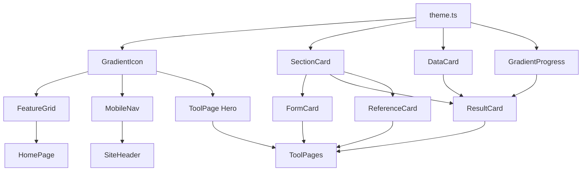

# Design Document - UI 重设计（薄荷健康风格）

## Overview

本设计文档定义了健身AI工具站的UI重设计技术方案，目标是实现与薄荷健康App几乎一致的视觉风格。设计将覆盖全局样式系统、核心UI组件、页面布局模板，并建立完整的审美规范。

## Architecture

### 设计系统架构

```
src/
├── lib/
│   └── config/
│       └── theme.ts              # 主题配置（颜色、渐变、间距）
├── components/
│   ├── ui/                       # 基础UI组件（shadcn扩展）
│   │   ├── gradient-icon.tsx     # 渐变图标组件
│   │   ├── section-card.tsx      # 带标题的区块卡片
│   │   ├── data-card.tsx         # 数据展示卡片
│   │   └── progress-bar.tsx      # 渐变进度条
│   ├── layout/
│   │   ├── site-header.tsx       # 导航栏（更新）
│   │   └── mobile-nav.tsx        # 移动端导航（更新）
│   └── home/
│       └── feature-grid.tsx      # 首页工具网格（更新）
├── app/
│   └── globals.css               # 全局样式（更新）
```

---

## Components and Interfaces

### 1. 主题配置 (theme.ts)

```typescript
// src/lib/config/theme.ts

export const toolGradients = {
  'ffmi-calculator': {
    from: '#FF9A8B',
    to: '#FF6B8A',
    angle: 135,
  },
  'skinfold-calculator': {
    from: '#4FACFE',
    to: '#00F2FE',
    angle: 135,
  },
  'bmr-calculator': {
    from: '#FFD93D',
    to: '#FF9500',
    angle: 135,
  },
  'heart-rate-calculator': {
    from: '#FF758C',
    to: '#FF7EB3',
    angle: 135,
  },
  'pose-comparator': {
    from: '#A18CD1',
    to: '#FBC2EB',
    angle: 135,
  },
  'grecian-calculator': {
    from: '#F6D365',
    to: '#FDA085',
    angle: 135,
  },
  'carb-cycling-calculator': {
    from: '#11998E',
    to: '#38EF7D',
    angle: 135,
  },
  'fat-loss-diet-calculator': {
    from: '#96E6A1',
    to: '#D4FC79',
    angle: 135,
  },
  'high-carb-diet-calculator': {
    from: '#F5AF19',
    to: '#F12711',
    angle: 135,
  },
  'metabolic-damage-test': {
    from: '#667EEA',
    to: '#764BA2',
    angle: 135,
  },
} as const;

export type ToolId = keyof typeof toolGradients;

export const colors = {
  primary: '#4CAF50',
  primaryLight: '#81C784',
  background: '#F5F7FA',
  card: '#FFFFFF',
  text: {
    primary: '#1F2937',
    secondary: '#6B7280',
    muted: '#9CA3AF',
  },
  border: '#E5E7EB',
  shadow: 'rgba(0, 0, 0, 0.08)',
};

export const spacing = {
  cardPadding: '20px',
  sectionGap: '16px',
  iconSize: {
    sm: 48,
    md: 56,
    lg: 64,
  },
};

export const borderRadius = {
  sm: '8px',
  md: '12px',
  lg: '16px',
  xl: '20px',
  full: '999px',
};
```

### 2. 渐变图标组件 (GradientIcon)

```typescript
// src/components/ui/gradient-icon.tsx

interface GradientIconProps {
  toolId: ToolId;
  icon: React.ComponentType<{ className?: string }>;
  size?: 'sm' | 'md' | 'lg';
  className?: string;
}

// 尺寸映射
const sizeMap = {
  sm: { container: 'w-12 h-12', icon: 'w-6 h-6' },      // 48px
  md: { container: 'w-14 h-14', icon: 'w-7 h-7' },      // 56px
  lg: { container: 'w-16 h-16', icon: 'w-8 h-8' },      // 64px
};

// 渲染渐变背景 + 白色图标
// 使用 inline style 设置 background: linear-gradient(...)
```

### 3. 区块卡片组件 (SectionCard)

```typescript
// src/components/ui/section-card.tsx

interface SectionCardProps {
  title: string;
  icon?: React.ReactNode;
  iconColor?: string;        // 标题图标颜色
  bgColor?: string;          // 标题背景色（10%透明度）
  children: React.ReactNode;
  className?: string;
}

// 结构：
// - 外层白色卡片，16px圆角，浅阴影
// - 左上角胶囊形状标题：图标 + 文字
// - 内容区域
```

### 4. 数据展示卡片 (DataCard)

```typescript
// src/components/ui/data-card.tsx

interface DataItem {
  label: string;           // 小标题
  value: string | number;  // 大数字
  unit?: string;           // 单位
  helpText?: string;       // 帮助说明
  bgColor?: string;        // 背景色
}

interface DataCardProps {
  items: DataItem[];
  columns?: 1 | 2;         // 分栏数
  className?: string;
}

// 结构：
// - 支持1-2列布局
// - 每项：左上角小标题(12px) + 大数字(32px) + 单位(14px)
// - 可选问号帮助图标
```

### 5. 渐变进度条 (GradientProgress)

```typescript
// src/components/ui/gradient-progress.tsx

interface GradientProgressProps {
  value: number;           // 0-100
  gradientFrom: string;
  gradientTo: string;
  showLabel?: boolean;
  label?: string;
  className?: string;
}

// 结构：
// - 8px高度，999px圆角
// - 渐变色填充
// - 可选百分比标签
```

---

## Data Models

### 工具配置数据结构

```typescript
interface ToolConfig {
  id: string;
  title: string;
  description: string;
  href: string;
  icon: LucideIcon;
  gradient: {
    from: string;
    to: string;
    angle: number;
  };
}
```

### 表单区块配置

```typescript
interface FormSection {
  id: string;
  title: string;
  icon: React.ReactNode;
  iconColor: string;
  fields: FormField[];
}

interface FormField {
  name: string;
  label: string;
  type: 'number' | 'select' | 'radio';
  unit?: string;
  placeholder?: string;
}
```

---

## 页面布局设计

### 首页布局

```
┌─────────────────────────────────────────┐
│  Header (白色毛玻璃, 56px高)              │
├─────────────────────────────────────────┤
│  Hero Section                           │
│  - 标题 + 副标题                         │
│  - 主色调渐变背景装饰                     │
├─────────────────────────────────────────┤
│  工具网格 (浅灰背景)                      │
│  ┌─────┬─────┬─────┬─────┬─────┐       │
│  │ 🔥  │ 📏  │ 💪  │ ❤️  │ 📷  │  移动端 │
│  │FFMI │体脂夹│代谢 │心率 │造型 │  横滚   │
│  └─────┴─────┴─────┴─────┴─────┘       │
│                                         │
│  桌面端: 2列网格，带描述                  │
├─────────────────────────────────────────┤
│  Why Choose Us (白色背景)                │
├─────────────────────────────────────────┤
│  Footer                                 │
└─────────────────────────────────────────┘
```

### 工具页面布局

```
┌─────────────────────────────────────────┐
│  Header                                 │
├─────────────────────────────────────────┤
│  Tool Hero                              │
│  ┌──────┐                               │
│  │渐变  │  工具名称                      │
│  │图标  │  简短描述                      │
│  └──────┘                               │
├─────────────────────────────────────────┤
│  ┌─────────────────┬─────────────────┐  │
│  │  表单区块        │  参考信息        │  │
│  │  ┌─基本信息────┐ │  ┌─参考标准────┐ │  │
│  │  │ 身高  体重  │ │  │ FFMI等级表  │ │  │
│  │  │ 体脂  年龄  │ │  │ ...         │ │  │
│  │  └────────────┘ │  └────────────┘ │  │
│  │                 │                 │  │
│  │  ┌─计算结果────┐ │                 │  │
│  │  │ FFMI: 22.5  │ │                 │  │
│  │  │ 瘦体重: 65kg│ │                 │  │
│  │  └────────────┘ │                 │  │
│  └─────────────────┴─────────────────┘  │
├─────────────────────────────────────────┤
│  详细说明 (全宽)                         │
├─────────────────────────────────────────┤
│  相关工具推荐 (横向滚动)                  │
└─────────────────────────────────────────┘
```

---

## 样式规范

### 全局CSS变量更新

```css
:root {
  /* 主色调 */
  --primary: #4CAF50;
  --primary-light: #81C784;
  --primary-dark: #388E3C;
  
  /* 背景色 */
  --background: #F5F7FA;
  --card: #FFFFFF;
  
  /* 文字色 */
  --text-primary: #1F2937;
  --text-secondary: #6B7280;
  --text-muted: #9CA3AF;
  
  /* 边框和阴影 */
  --border: #E5E7EB;
  --shadow-sm: 0 1px 3px rgba(0, 0, 0, 0.08);
  --shadow-md: 0 4px 12px rgba(0, 0, 0, 0.1);
  
  /* 圆角 */
  --radius-sm: 8px;
  --radius-md: 12px;
  --radius-lg: 16px;
  --radius-xl: 20px;
  --radius-full: 999px;
}
```

### 组件样式类

```css
/* 渐变图标容器 */
.gradient-icon {
  @apply rounded-[20px] flex items-center justify-center;
  box-shadow: 0 4px 12px rgba(0, 0, 0, 0.1);
}

/* 区块卡片 */
.section-card {
  @apply bg-white rounded-2xl p-5;
  box-shadow: 0 1px 3px rgba(0, 0, 0, 0.08);
}

/* 区块标题胶囊 */
.section-title {
  @apply inline-flex items-center gap-1.5 px-3 py-1.5 rounded-full text-sm font-medium;
}

/* 数据大数字 */
.data-value {
  @apply text-3xl font-bold tracking-tight;
}

/* 输入框新样式 */
.input-fresh {
  @apply bg-gray-100 border-0 rounded-xl h-12 px-4;
  @apply focus:ring-2 focus:ring-primary/50 focus:bg-white;
}
```

---

## Error Handling

1. 渐变色降级：如果浏览器不支持 CSS 渐变，使用纯色背景作为降级方案
2. 图标加载失败：显示默认占位图标
3. 深色模式兼容：确保所有渐变色在深色模式下保持可读性

---

## Testing Strategy

1. 视觉回归测试：使用截图对比确保UI一致性
2. 响应式测试：测试移动端(375px)、平板(768px)、桌面(1280px)三个断点
3. 深色模式测试：确保所有组件在深色模式下正常显示
4. 可访问性测试：确保颜色对比度符合WCAG 2.1 AA标准

---

## 组件映射关系

| 现有组件 | 更新内容 |
|---------|---------|
| `Card` | 更新圆角为16px，移除边框，使用浅阴影 |
| `Button` | 更新圆角为12px，主按钮使用渐变背景 |
| `Input` | 更新为无边框浅灰背景样式 |
| `SiteHeader` | 更新为白色毛玻璃效果，绿色Logo |
| `MobileNav` | 更新为圆角侧边栏，使用渐变图标 |
| `FeatureGrid` | 重写为横向滚动+渐变图标布局 |

| 新增组件 | 用途 |
|---------|------|
| `GradientIcon` | 渐变色图标容器 |
| `SectionCard` | 带左上角标题的区块卡片 |
| `DataCard` | 数据展示卡片 |
| `GradientProgress` | 渐变进度条 |

---

## Mermaid 组件关系图


